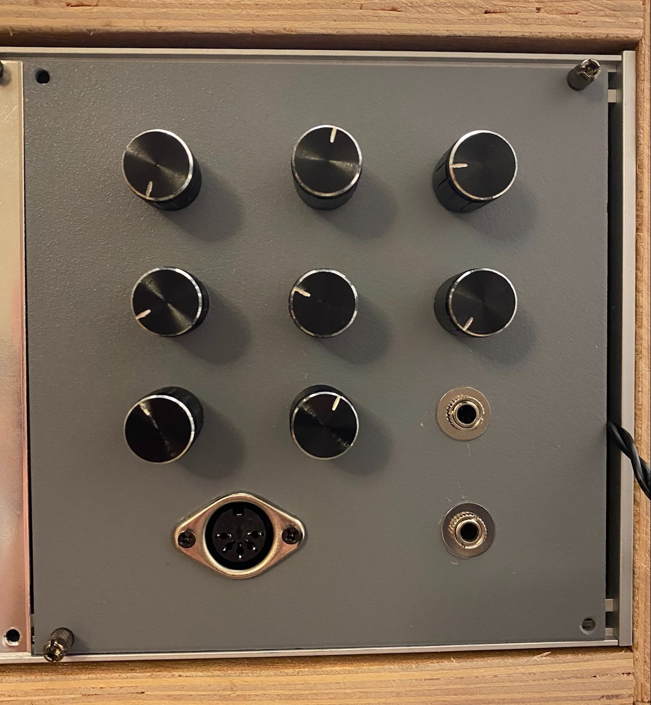

# Eurorack synth voice using Pro-Micro controller

## Circuit:
- Midi In on RX using 6N138 optocoupler
- Multiplexer with 8 pots
- audio out x2
- 16 pin eurorack power in

## Code:
- using MIDI, Mozzi and Mux libraries
- Pots can be mapped to any parameters in the synth

## Finished front panel

## Panel after paint and clear coat

## Protoboard wiring and components

Resources used: 
- [Mozzi Library](https://sensorium.github.io/Mozzi/)
- [Midi library](https://www.arduino.cc/reference/en/libraries/midi-library/)
- [Mux Library](https://github.com/stechio/arduino-ad-mux-lib)
- [Notes and Volts Midi in](https://www.notesandvolts.com/2015/02/midi-and-arduino-build-midi-input.html)
